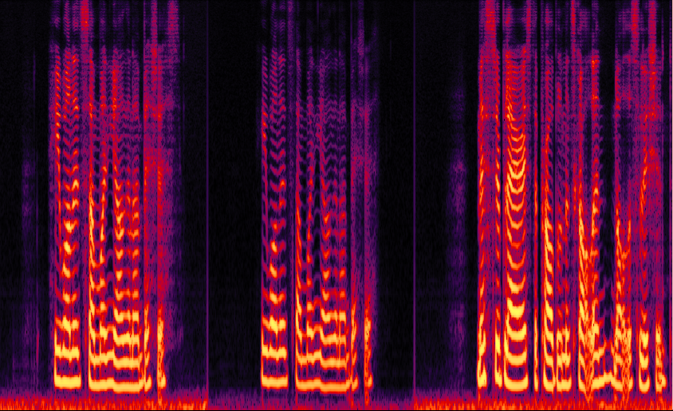
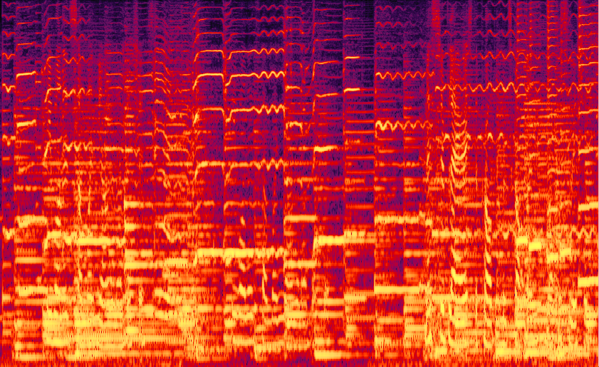

# Speech-Enhancement
Practice on speech enhancement exploiting deep learning method. The neural network we choose is TF-GridNet, an excellent architecture in the field of speech separation, more details can be found here: [TF-GridNet](https://arxiv.org/abs/2209.03952).

## Progressive Learning Strategy
However, in this repository, we also combine progressive learning strategy with original TF-GridNet to achieve better enhancement performance. Pre-trained models under two different strategies are available here: [Direct Learning](https://drive.google.com/file/d/1krMSO78aNgLXAPRHsqjZVi07k4AkLoj_/view?usp=sharing) & [Progressive Learning](https://drive.google.com/file/d/1NbIED2f79Uw9P5H5zRWcSanl4mWuQJiJ/view?usp=sharing)

## Performance Evaluation Based On DNS5 Test Dataset
Experiment results show that TF-GridNet-PL(progressive learning) outperforms TF-GridNet-DL(direct learning) under DNSMOS metrics(table 1). 

But it's interesting to find that under PESQ, performance of TF-GridNet-PL is worse than its DL version(table 2).    

**Table 1**: DNSMOS on DNS5 test dataset
|    |Para. (M)|MACs (G/s)|DNSMOS-P.808|BAK|SIG|OVRL|
|:--:|:-------:|:--------:|:----------:|:-:|:-:|:--:|
|Noisy|-|-|2.846|2.341|2.918|2.147|
|TF-GridNet-DL|2.36|33.65|3.826|4.113|3.454|3.187|
|TF-GridNet-PL|2.36|33.69|**3.877**|**4.128**|**3.481**|**3.219**|

**Table 2**: intrusive metrics on DNS5 test dataset
|    |Para. (M)|MACs (G/s)|PESQ|STOI|SI-SNR|
|:--:|:-------:|:--------:|:----------:|:-:|:-:|
|Noisy|-|-|1.391|0.784|2.918|2.147|
|TF-GridNet-DL|2.36|33.65|**2.763**|**0.882**|16.827|
|TF-GridNet-PL|2.36|33.69|2.519|0.880|**17.571**|

## Audio Examples
<figure>                                                     
  <figcaption>Clean Speech:</figcaption>
    
</figure>

<figure>
  <figcaption>Noisy Speech:</figcaption>
  
</figure>

<figure>
  <figcaption>Enhanced by TF-GridNet-DL:</figcaption>
  
</figure>

<figure>
  <figcaption>Enhanced by TF-GridNet-PL:</figcaption>
  
</figure>

## Acknowledgement
This code extensively references the excellent [SEtrain](https://github.com/Xiaobin-Rong/SEtrain) codebase and open source of [TF-GridBlock](https://github.com/espnet/espnet/blob/master/espnet2/enh/separator/tfgridnet_separator.py).

